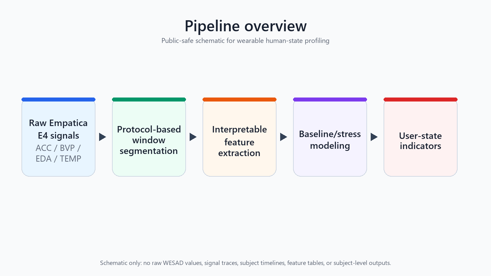
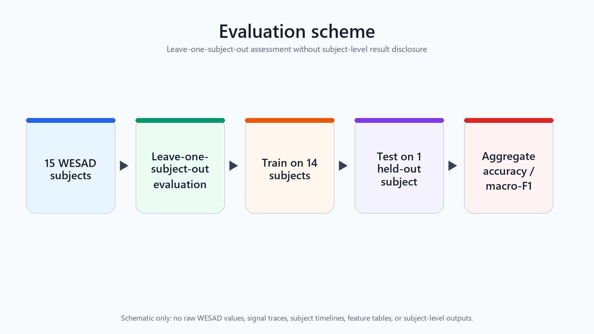

# Wearable Human-State Profiling from Physiological Signals

A raw WESAD Empatica E4 baseline pipeline for wearable human-state sensing research

This project is a small, reproducible Python research demo for wearable human-state sensing experiments with the WESAD dataset. The current version starts from the raw Empatica E4 CSV files stored inside each `Sx_E4_Data.zip` archive and uses questionnaire timing metadata from `Sx_quest.csv` to segment the recording into protocol conditions.

## Project Purpose

The goal of this repository is to provide a simple and readable starting point for wearable stress detection experiments. It focuses on a small first version that is easy to inspect, run, and extend rather than a fully optimized research pipeline.

## Research positioning: from infrastructure state assessment to human-state sensing

My previous work focused on infrastructure sensing, condition assessment, quality evaluation, and decision-oriented analysis. This demo transfers the same assessment logic to human-centered wearable sensing: raw measurements are organized, processed, summarized, and evaluated as evidence of a system state.

The pipeline follows a familiar chain:

```text
raw sensor data -> preprocessing -> feature extraction -> state assessment -> evaluation
```

In this repository, the current state-assessment task is baseline vs stress recognition from wearable Empatica E4 signals. The demo should be read as a baseline research example, not a final deployable stress-recognition system or a clinical tool. Its purpose is to show a reproducible path from raw physiological and motion data to a transparent human-state sensing evaluation.

For a fuller explanation of this positioning, see `docs/research_positioning.md`.

## Human factors and ergonomics perspective

This demo is not a physical ergonomics posture-risk demo. It does not estimate posture, joint loading, RULA/REBA scores, or musculoskeletal risk.

Instead, it focuses on cognitive and affective ergonomics: stress, psychophysiological strain, and human-state assessment. The pipeline uses wrist-worn physiological and motion signals to estimate whether a subject is in a baseline or stress condition.

From a human factors perspective, the analysis can be interpreted as an offline research example for studying operator state, workload-related signals, and human-centered sensing. The current result is a baseline demonstration, not a deployable stress-monitoring system, diagnosis tool, medical advice, or health assessment product.

For a fuller explanation of this human factors framing, see `docs/human_factors_positioning.md`.

## Interpretation and feedback layer

This repository is no longer only a classifier demo. It also explores how wearable signals can be transformed into interpretable user-state indicators for human-computer interaction research.

The added interpretation layer generates subject-level state profiles, lightweight explanation summaries, ambiguity reports, and user-facing feedback card examples. These artifacts are generated locally from the user's own WESAD copy and are written under `outputs/`.

The layer uses transparent methods: feature-group aggregation, logistic-regression model-associated feature weights, descriptive stress-minus-baseline feature differences, and probability-based ambiguity flags for logistic-regression outputs near 0.5. These summaries are intended to support careful interpretation of the WESAD protocol baseline/stress distinction. They are not causal explanations and are not clinical conclusions.

Generated profile tables, feature-change tables, ambiguity reports, and feedback cards are not committed because they are derived from WESAD subject data. This repository remains a research demo, not a clinical system, diagnosis tool, medical advice, or deployable stress monitor.

For a fuller explanation of this layer, see `docs/feedback_interpretation_layer.md`.

## HCI relevance

This demo is exploratory and non-clinical. It is not intended to develop a
deployable stress-monitoring product, mental-health diagnosis tool, or
deployment-ready health-monitoring product. Instead, it explores how wearable
physiological signals can be organized into interpretable human-state
indicators.

In the broader research direction, this wearable-sensing prototype is treated
as complementary state information that may support movement-based and embodied
feedback, rather than as a standalone clinical stress-detection system.

From an HCI perspective, the next question is not only whether baseline and
stress conditions can be classified, but how sensing outputs may be communicated
to users in a personalized and understandable way. Possible next steps include
generating subject-level state profiles, explaining which signal patterns
changed, communicating model uncertainty, and comparing different styles of
reflective feedback.

## Pipeline Overview



The public-safe schematic above summarizes the repository flow: raw Empatica E4 ACC, BVP, EDA, and TEMP signals are segmented by protocol windows, converted into interpretable features, modeled for baseline/stress classification, and summarized as user-state indicators.

The current wearable signals are ACC, BVP, EDA, and TEMP from the wrist-worn Empatica E4. The current repository does not use video, audio, EEG, eye tracking, posture data, or other sensing channels.

## Dataset Access

This repository does not redistribute the WESAD dataset. Users must obtain WESAD from the official dataset source and comply with the official license or access terms themselves.

The local data layout below is documented only so that experiments can be reproduced after users have obtained the dataset independently. The repository provides a reproducible processing and evaluation pipeline, not the dataset itself.

In the expected local layout, raw WESAD subject folders, raw subject files, `.pkl` files, Empatica E4 zip files, quest files, and generated outputs are ignored and should not be committed. Keep local dataset files under `data/` and generated results under `outputs/`.

## Evaluation Scheme



The evaluation schematic shows the leave-one-subject-out setup used for multi-subject baseline assessment: each fold trains on 14 WESAD subjects, tests on 1 held-out subject, and reports aggregate accuracy and macro-F1. The figure is schematic only and does not contain WESAD signal traces, subject-level timelines, feature tables, or subject-level results.

## Expected Local Data Layout

After obtaining WESAD independently, keep the local folder structure unchanged:

```text
wearable-human-state-profiling/
|- data/
|  |- S2/
|  |  |- S2_E4_Data.zip
|  |  |- S2_quest.csv
|  |  |- S2_readme.txt
|  |  `- S2.pkl
|  |- S3/
|  |  |- S3_E4_Data.zip
|  |  |- S3_quest.csv
|  |  |- S3_readme.txt
|  |  `- S3.pkl
|  `- ...
`- src/
```

The demo uses:

- `Sx_E4_Data.zip` as the main raw input
- `Sx_quest.csv` for protocol timing
- `Sx_readme.txt` only as an optional reference

The demo does not use `Sx.pkl` as the main input.

## Do Not Commit Data

The WESAD dataset files should be kept locally under `data/` and must not be uploaded to GitHub. Generated outputs should be kept locally under `outputs/` and should not be committed.

## How To Run The S2 Demo

Run the exact command below from the project root:

```bash
python -m src.run_demo --data_dir data --subjects S2 --output_dir outputs --task binary
```

## Optional Multi-Subject Run

If you want to test multiple subjects later, you can run:

```bash
python -m src.run_demo --data_dir data --subjects S2 S3 S4 S5 S6 S7 S8 S9 S10 S11 S13 S14 S15 S16 S17 --output_dir outputs --task binary
```

## Current Results

The current multi-subject baseline was run on these subjects:

- Subjects: `S2, S3, S4, S5, S6, S7, S8, S9, S10, S11, S13, S14, S15, S16, S17`
- Total valid windows: `1424`
- Binary modeling windows: `897`
- Evaluation: `leave-one-subject-out`
- Logistic regression: accuracy `0.7781`, macro-F1 `0.7677`
- Random forest: accuracy `0.7458`, macro-F1 `0.7090`

This is a baseline demo using raw Empatica E4 CSV data and protocol timings from `Sx_quest.csv`.

Logistic regression performed slightly better than random forest in this baseline setting. The result suggests that simple statistical features from wrist-worn signals contain useful stress-related information in this benchmark task. The result should be interpreted as a baseline, not a final stress-recognition system, health product, or clinical method.

## What The Demo Does

1. Finds subject folders under `data/`
2. Reads raw `ACC.csv`, `BVP.csv`, `EDA.csv`, and `TEMP.csv` from each subject's `Sx_E4_Data.zip`
3. Parses condition order and time ranges from `Sx_quest.csv`
4. Segments each condition into 60-second windows with a 30-second step
5. Extracts simple statistical features from each window
6. Trains baseline binary classifiers for `baseline` vs `stress`
7. Exports tables, a confusion matrix figure, an EDA timeline figure, and a short markdown report
8. Builds subject-level baseline/stress state profiles
9. Summarizes lightweight model-associated and descriptive explanations
10. Flags ambiguous logistic-regression outputs near the binary decision boundary
11. Generates research-demo feedback card examples for HCI interpretation

## Output Files

The demo writes these files:

```text
outputs/
|- demo_report.md
|- figures/
|  |- confusion_matrix.png
|  `- eda_timeline.png
|- reports/
|  |- subject_profile_cards.md
|  `- user_feedback_cards.md
`- tables/
   |- classification_report.csv
   |- confusion_matrix.csv
   |- feature_importance_summary.csv
   |- feedback_card_summary.csv
   |- model_results.csv
   |- subject_state_profiles.csv
   |- subject_loso_metrics.csv
   |- subject_top_feature_changes.csv
   |- subject_window_summary.csv
   |- uncertain_windows.csv
   `- window_features.csv
```

These outputs include the extracted window-level features, subject-level window counts, model metrics, subject-level leave-one-subject-out metrics, a detailed classification report, a confusion matrix table, beginner-friendly visual summaries, subject-level profile summaries, lightweight explanation tables, ambiguity reports, and feedback-card examples.

## Limitations

This raw E4 CSV version uses protocol timings from `Sx_quest.csv` and does not fully solve E4-RespiBAN synchronization. It uses only Empatica E4 ACC, BVP, EDA, and TEMP signals; it does not use video, audio, EEG, eye tracking, posture data, RULA/REBA scoring, or musculoskeletal-load assessment. More advanced versions may add double-tap synchronization, HRV features, EDA tonic/phasic decomposition, motion artifact filtering, and optional `Sx.pkl` validation.

The current pipeline is a baseline research demonstration, not a deployable stress-monitoring system, occupational health system, clinical system, diagnosis tool, or source of medical advice.

## Dataset Citation

If you use WESAD in your work, please cite:

Philip Schmidt, Attila Reiss, Robert Duerichen, Claus Marberger, and Kristof Van Laerhoven. 2018. Introducing WESAD, a multimodal dataset for Wearable Stress and Affect Detection. ICMI 2018.
