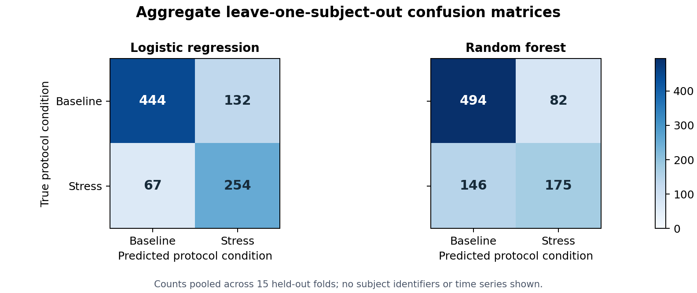
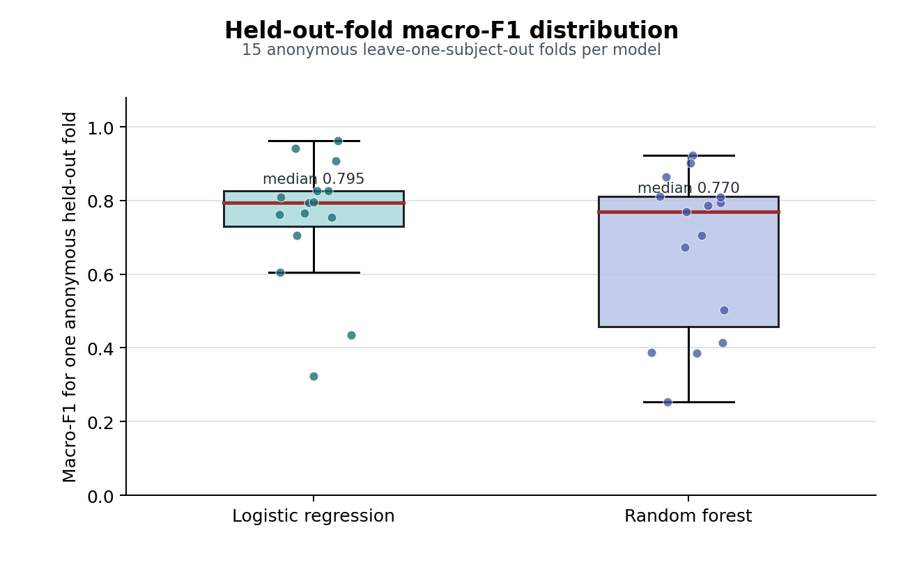

# Wearable Human-State Profiling from Physiological Signals

**A reproducible and uncertainty-aware baseline for operator-state sensing and interpretable feedback in human-centred automation.**

This repository extends my monitoring-to-decision research from engineering and manufacturing-process states to human states in human-centred automation. It explores how wearable physiological and motion signals can support interpretable operator-state assessment, uncertainty-aware feedback, and future adaptive human-machine collaboration.

The current benchmark task distinguishes WESAD protocol baseline and stress conditions. It is designed as a transparent research baseline that connects sensing, state estimation, evaluation, and feedback—not as a diagnosis or a completed automation system.

## Project purpose

The repository provides a readable, reproducible path from raw Empatica E4 recordings to operator-state evidence. It applies the same monitoring-to-decision logic used in engineering systems: organize heterogeneous measurements, build interpretable state representations, quantify model performance and ambiguity, and communicate results in a form that could inform later human-machine decisions.

## Potential Role in Human-Centred Automation

```text
wearable sensing
-> operator-state estimation
-> confidence and ambiguity assessment
-> assistance / task-allocation / interface feedback
-> human confirmation or system adaptation
```

The current repository implements wearable sensing, baseline/stress state modelling, uncertainty flags, subject profiles, and feedback cards. It does not yet implement robot control or adaptive task allocation. Its outputs can serve as a future operator-state input for HRC or other human-centred automation systems, with human confirmation and appropriate validation retained in the decision loop.

## Completed pipeline


The implemented pipeline covers:

- raw Empatica E4 ACC, BVP, EDA, and TEMP ingestion from each subject archive;
- protocol-based window segmentation using questionnaire timing metadata;
- interpretable multimodal statistical feature extraction;
- leave-one-subject-out baseline/stress modelling with logistic regression and random forest baselines;
- subject-level state profiles;
- uncertainty and ambiguous-output flags for logistic-regression probabilities near the decision boundary; and
- feedback-card generation for interpretable state communication.

The interpretation layer combines feature-group summaries, model-associated feature weights, descriptive stress-minus-baseline differences, and probability-based ambiguity flags. These are transparent associations and decision aids rather than causal explanations. More detail is available in [the feedback interpretation documentation](docs/feedback_interpretation_layer.md).

## Evaluation scheme


For multi-subject evaluation, each leave-one-subject-out fold trains on 14 participants and evaluates on one held-out participant. The current binary evaluation contains 897 baseline/stress windows from 15 participants; all predictions are made for participants excluded from their corresponding training folds.

## Public aggregate results

The current LOSO baseline reports:

- logistic regression: accuracy **0.7781**, macro-F1 **0.7677**;
- random forest: accuracy **0.7458**, macro-F1 **0.7090**;
- across 15 anonymised held-out folds, logistic-regression macro-F1 has median **0.7948** (IQR **0.7293–0.8265**), while random-forest macro-F1 has median **0.7703** (IQR **0.4582–0.8104**).

Only aggregate and anonymised material is published here. The machine-readable summary is in [`docs/public_results/public_results_summary.csv`](docs/public_results/public_results_summary.csv).





See the [generic example feedback card](docs/public_results/example_feedback_card.md) for a public-safe illustration of how an ambiguous operator-state output could be communicated.

## Dataset access

This repository does not redistribute WESAD. Users must obtain the dataset from its official source and comply with its licence or access terms.

After obtaining WESAD independently, place subject files under `data/`:

```text
wearable-human-state-profiling/
|- data/
|  |- S2/
|  |  |- S2_E4_Data.zip
|  |  |- S2_quest.csv
|  |  |- S2_readme.txt
|  |  `- S2.pkl
|  `- ...
`- src/
```

The pipeline reads `Sx_E4_Data.zip` and `Sx_quest.csv`; `Sx_readme.txt` is an optional reference, and `Sx.pkl` is not used as the main input. Raw subject folders, archives, `.pkl` files, generated feature tables, reports, and full outputs remain local and ignored by Git.

## Run the demo

Run a single-subject processing demo from the project root:

```bash
python -m src.run_demo --data_dir data --subjects S2 --output_dir outputs --task binary
```

Run the current multi-subject evaluation with:

```bash
python -m src.run_demo --data_dir data --subjects S2 S3 S4 S5 S6 S7 S8 S9 S10 S11 S13 S14 S15 S16 S17 --output_dir outputs --task binary
```

The demo writes generated figures, reports, model metrics, subject summaries, ambiguity tables, feedback cards, and window features under `outputs/`. That directory is intentionally ignored and must not be committed.

## Scope and limitations

- This is not a clinical stress detector, mental-health diagnosis method, deployable stress-monitoring product, or source of medical advice.
- This is not yet an HRC control system: robot adaptation and adaptive task allocation have not been implemented.
- WESAD is used as an experimental public dataset; users must obtain it from the official source and licence it themselves.
- Generated subject-level outputs, subject time series, window-level features, raw archives, and raw signals are not committed.
- Protocol labels distinguish the dataset's baseline and stress conditions; they do not establish a person's health or mental state.
- The current preprocessing does not fully solve E4–RespiBAN synchronisation. Future work may add stronger synchronisation, HRV features, EDA decomposition, motion-artifact filtering, probability calibration, and validation in task-specific human-centred automation studies.

## Dataset citation

If you use WESAD, please cite:

Philip Schmidt, Attila Reiss, Robert Duerichen, Claus Marberger, and Kristof Van Laerhoven. 2018. Introducing WESAD, a multimodal dataset for Wearable Stress and Affect Detection. ICMI 2018.
